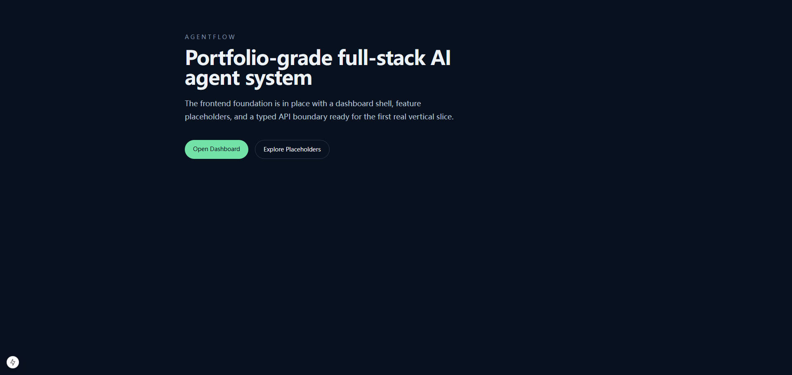
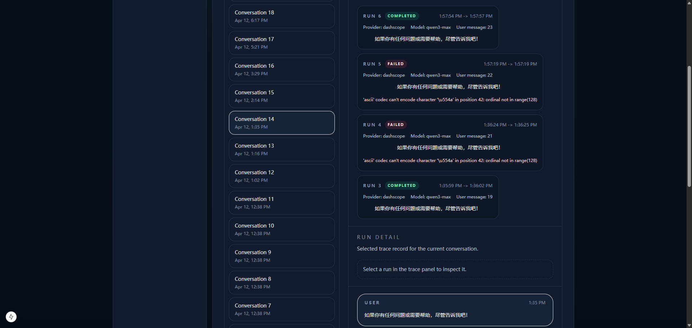
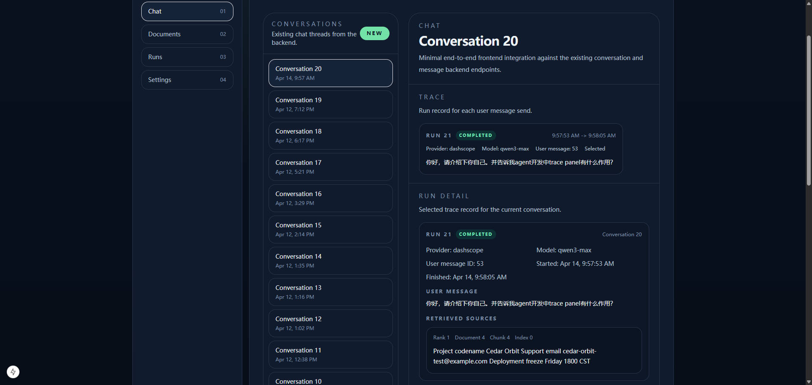
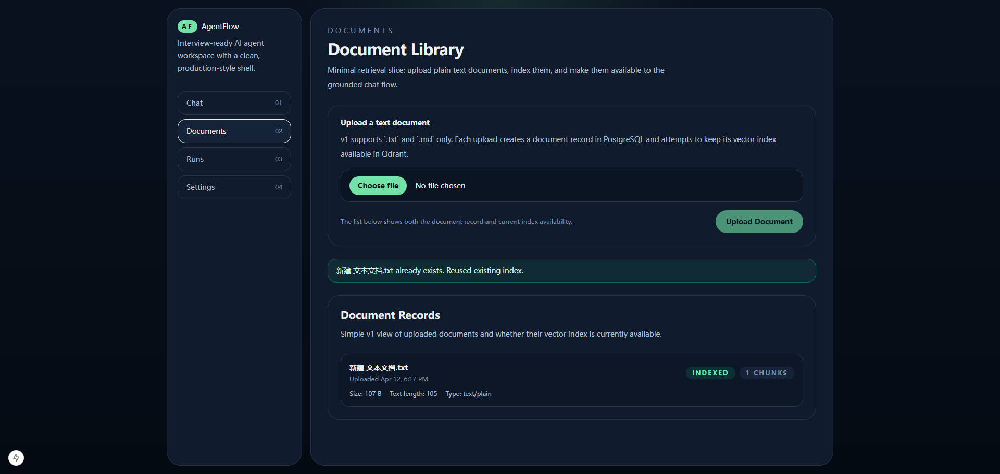

# AgentFlow

Portfolio-grade full-stack AI agent system for job interviews and new graduate job hunting.

This repository is intentionally starting with a minimal, production-style skeleton:
- `apps/web`: Next.js frontend
- `apps/api`: FastAPI backend
- `infra`: local infrastructure assets
- `docs`: architecture and delivery notes
- `scripts`: setup and workflow helpers

## Current Status

Step 1 is complete:
- repository skeleton
- local infrastructure layout
- minimal backend starter
- minimal frontend starter

No authentication, business logic, or AI agent workflows have been added yet.

## Local Services

`docker-compose.yml` provides:
- PostgreSQL
- Redis
- Qdrant

## Quick Start

1. Copy `.env.example` to `.env`
2. Start infrastructure with `make up`
3. Build app code in `apps/api` and `apps/web`

## Planned Features

- Chat UI
- Tool-calling agent workflow
- Retrieval over uploaded documents
- Task history and execution trace

## Project Display
### Guides Page

### Conversation_display
#### Trace_display_failure_Instances

#### Trace_display_success_Instances

### Documents Page
